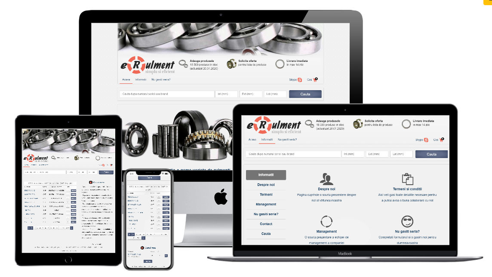

 
# 

> ### Bearings online catalog used in production by client, built using Cart functionality, advanced PHP funtional programming patterns and objects, Jquery, HTML/CSS, MySQL utilities. Clients can browse through 18000 bearings by dimensions and name, request price offers. Both the owner and the client receive an email notification with the cart details. The website is mobile responsive.

----------

## Website mockup

## The website has cart and subscribe features, available in Romanian.
## Live version Demo:

[Romanian version Link](https://www.erulment.ro)

## Future features

Currently working on the admin page where the client will manage the database of bearings and clients

## Built With

- PHP
- MySQL
- Javascript/Jquery
- Ajax
- HTML
- CSS

# Getting started

## Prerequisites

1. PHP - I recommend installing [xampp](https://www.apachefriends.org/index.html) but you have other options on their [official website](https://www.php.net/manual/en/install.php)
2. MySQL database
3. Email account

## Installation

Clone the repository

    `git clone git@github.com:cristianCeamatu/erulment.ro.git`

Switch to the repo folder

    `cd erulment.ro`

Add your database and email account details in the file located at:

    `incl/config.inc.php`

Start XAMPP or your preferred PHP server

    Navigate to `http://localhost/erulment/` (only for XAMPP users, check your PORT for other apps)

## Authors

👤 **Cristian Viorel Ceamatu**

- Email: [cristian.ceamatu@gmail.com](cristian.ceamatu@gmail.com)
- Github: [https://github.com/cristianCeamatu](https://github.com/cristianCeamatu)
- Twitter: [https://twitter.com/CristianCeamatu](https://twitter.com/CristianCeamatu)
- Linkedin: [https://www.linkedin.com/in/ceamatu-cristian/](https://www.linkedin.com/in/ceamatu-cristian/)

## Show your support

Give a ⭐️ if you like this project!

## 📝 License

This project is [MIT](lic.url) licensed.
